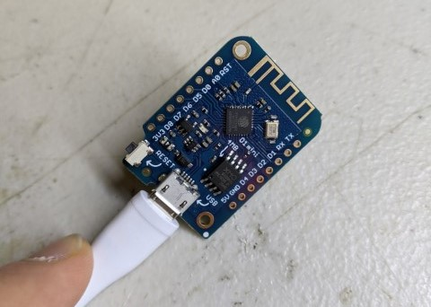

# ESP8266 Online Status
ESP8266 to hit URL for updating status cake.

Minimal modification of BasicHTTPClient.ino for use as online status tool using statuscake. GETs a URL at statuscake every 10s to report if Artifactory internet is online at the space.

